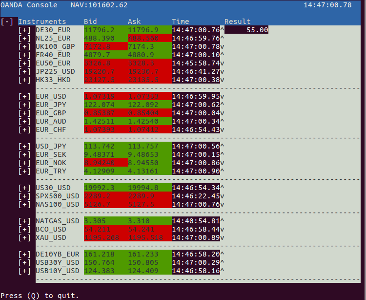

oandapyV20 - examples
=====================

This repo contains a number of examples to demonstrate how to
use OANDA's REST-V20 API with the oandapyV20_ Python API-wrapper.

.. _oandapyV20: https://github.com/hootnot/oanda-api-v20

Setup
-----

Install
~~~~~~~

Clone the repository:

.. code-block:: bash

   $ git clone https://github.com/hootnot/oandapyV20-examples

Install *oandapyV20* and other pypi-packages the examples depend on. Maybe
you want to do this from a *virtual environment*.

.. code-block:: bash

   $ pip install -r requirements.txt

Token
~~~~~

Access to the OANDA V20 REST-API requires a token. If you do not have a token
you can obtain one. Check developer.oanda.com_ for details.
Edit the file *token.txt*  and put the token in it.

.. _developer.oanda.com: http://developer.oanda.com

AccountID
~~~~~~~~~

If you have a token, you have an account. Edit the file *account.txt* and
put the **accountID** in it. Verify that it is your **V20** accountID!

**Warning**
~~~~~~~~~~~

   Make sure you have made the setup based on a **practice** account !
   Leveraged trading is high risk. Losses can exceed investment!

Examples
--------

All examples can be run from the cloned repo directory as:

.. code-block:: bash

   $ python src/<example.py>

=============================  =============
Source                         Description
=============================  =============
**Streams**
`src/streaming_prices.py`      Simple streaming prices
`src/streaming_trans.py`       Simple streaming transactions
`src/concurrent_streaming.py`  Demonstrate concurrent streaming of prices and events along with the polling of account changes based on gevent greenlets
**Data**
`src/candle-data.py`           Retrieve candle data
**Orders**
`src/market_order.py`          Placing market orders / logging
`src/market_order_request.py`  Placing market orders using contrib.requests / logging
`src/contrib_mo_tp_sl.py`      Placing market order with takeprofit on-fill and stoploss on-fill
**Console**
`src/oanda_console.py`         Console application showing realtime tickdata

                               |CONSOLE_APP|
=============================  =============
